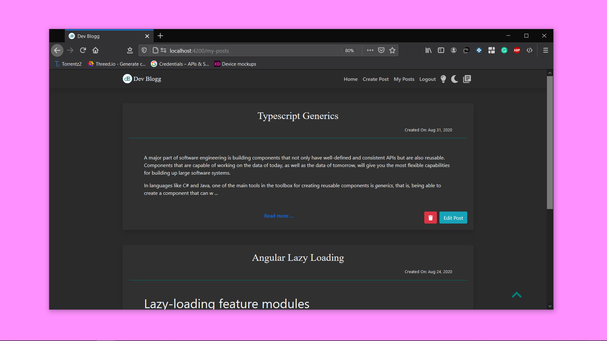
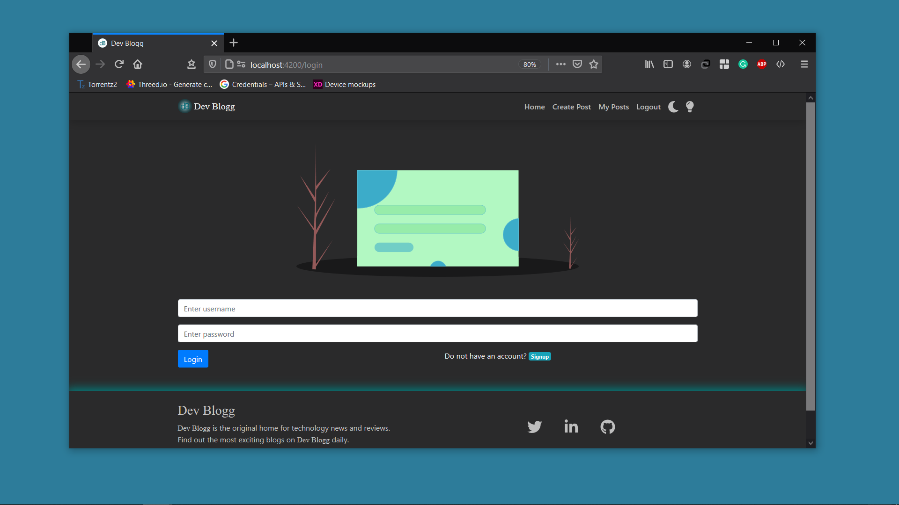

<h1 align="center"></h1>

A full-stack website where you can write *Dev Bloggs* and showcase them to the community. Every user is required to be *logged in* to write the *Dev Bloggs*. The simple UI of the web app makes it more attractive as well as user friendly.

## Getting Started 🚀

These instructions will get you a copy of the project up and running on your local machine for development and testing purposes.

You'll need [Git](https://git-scm.com) and [Node.js](https://nodejs.org/en/download/) (which comes with [npm](http://npmjs.com)) installed on your computer.

```
node@v10.16.0 or higher
npm@6.9.0 or higher
git@2.17.1 or higher
```

## How To Use 🔧

From your command line, clone and run DevBlogg:

```bash
# Clone this repository
$ git clone https://github.com/PulkitBanta/Dev-Blogg.git
```

* Running the Frontend development server
```bash

# Go into the repository
$ cd Dev-Blogg

# Install dependencies
$ npm install

#Start's development server
$ npm start

```

* Running the Backend development server
```bash

# Go into the repository
$ cd Dev-Blogg/backend

# Install dependencies
$ mvn install

#Start's development server
$ mvn spring-boot:run
```

* **Note** - If you get an error make sure you are running the backend development server and it is connected to MySql Server. 

## ScreenShots







## Features

- Multiple themes.
- Material design.
- Responsive design.
- Login and Signup feature.
- CRUD operations on Posts.

## Upcoming Features

- [x] Dark Mode.
- [x] Delete Post.
- [x] Reading Mode.
- [x] Edit Post.
- [ ] Post Tags.

## Built With

- [Angular](https://angular.io) - One framework. Mobile & desktop.
- [Bootstrap 4](https://getbootstrap.com/docs/4.0/getting-started/introduction/) - A modern responsive front-end framework.
- [SpringBoot](https://spring.io/projects/spring-boot) - Spring Boot makes it easy to create stand-alone, production-grade Spring based Applications that you can *"just run"*.
- [Maven](https://maven.apache.org) - Apache Maven is a software project management and comprehension tool.
- [MySQL](https://www.mysql.com/) - MySQL is an open-source relational database management system.

## Contributing

The project is open to all sort of contributions.

## Contributors

| [](https://github.com/PulkitBanta) |
| --- |
| [Pulkit Banta](https://github.com/PulkitBanta) |
| <p align="center"><a title="code">💻</a> <a title="designing">🎨</a> <a title="documentation">📖</a></p>

## License

This project is licensed under the MIT License - see the [LICENSE](LICENSE) file for details